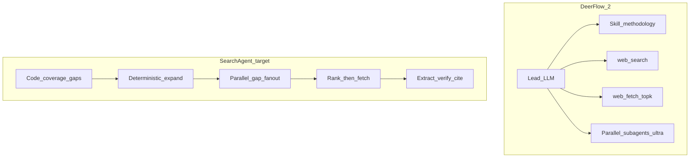

# Search Agent — 整体规划（对标 DeerFlow / 通用 Deep Research）

> 2026-07-30 · 基于 `D:\Agent-self-education\deer-flow` 与本仓现状对照  
> 原则不变：**确定引擎控策略；LLM 只理解文本与表达；每句可验证。**

## 1. 人家为什么更「全」

DeerFlow 2.0 已不是 v1 的 Coordinator→Planner→Researcher 固定图，而是：

**Lead Agent（LLM 循环）+ deep-research Skill（方法论）+ 可选 Plan/并行子代理 + web_search/web_fetch**

更全面的机制（可复现理解）：

| # | DeerFlow 做法 | 我们现状 | 差距 |
|---|--------------|----------|------|
| 1 | Broad → Deep Dive → Diversity → Synthesis Check，禁止 1–2 次搜就写 | 有 hop + coverage，但通用停跳/维度仍偏薄 | 合成门禁不够硬 |
| 2 | Ultra：按角度并行子代理 | 单 loop，多 query 偏顺序 | **并行扇出不足** |
| 3 | LLM 根据已读内容动态换 query | `query_expand` 模板 | 模板覆盖面 < 动态追问 |
| 4 | Snippet 后挑权威页 `web_fetch` | 搜到的尽量全文 extract | **信噪与深度取舍差** |
| 5 | 信息类型矩阵（facts/cases/experts/trends/comparisons/challenges） | PD 有；通用部分有 | 通用「反面/案例」硬要求弱 |
| 6 | 时间粒度（今天/本周/月）写进 query | 有年月/H1 | 「今天」类不够 |
| 7 | 多模式 flash→ultra（深度旋钮） | 默认深挖，无快慢档 | UX 与成本控制弱 |
| 8 | 多搜索后端可插拔 | 主 Tavily + DDG 降级 | 单引擎召回上限 |

结论：**不是「他们有魔法」，而是（并行 + 迭代反思 + 选择性深读 + 硬质量条）叠在一起。**  
我们不该整盘改成 LLM 主控（违背白箱/可复现），而应把上述机制 **确定性化**。

## 2. 我们的定位（不要跟错赛道）

| | Perplexity / DeerFlow | Search Agent |
|--|----------------------|--------------|
| 卖点 | 替你想明白、写漂亮 | 方案可审计、事实可点开验 |
| 风险 | 黑箱、编造、不可复现 | 召回窄、停太早、角度少 |
| 目标体验 | 「像顾问聊完」 | 「像研究员交了可核对的简报」 |

短期目标：**通用题上召回与覆盖接近 DeerFlow Pro 档，同时保留引用与事件日志。**  
不是变成第二个 DeerFlow。

## 3. 能力差距 → 路线图

### Wave 10 — 全面性核心（优先，对标「为什么更全」）

| Step | 内容 | 学自 | 兼容确定引擎 |
|------|------|------|--------------|
| 58 | **同 hop 并行 gap 扇出**（多 open query / 多 gap 并发 search+fetch） | Ultra 并行 | ✅ |
| 59 | **Snippet 排序后 top-K 深读**（域名权威分 + 相关度；其余只留 snippet 级） | 选择性 fetch | ✅ |
| 60 | **通用合成门禁**：examples / challenges / experts 等硬 gap | Skill Phase 3–4 | ✅ |
| 61 | **权威源 query 模板**（industry report / BAKOM / case study / limitations） | Skill 查询技巧 | ✅ |
| 62 | **快 / 标准 / 深** 三档（源数、hops、open 条数、是否 advanced） | flash→ultra | ✅ |

### Wave 11 — 瑞士 / 垂直召回（服务联通等真实题）

| Step | 内容 |
|------|------|
| 63 | 瑞士电信轻量 catalog（BAKOM、ComCom、Swisscom/Sunrise/Salt IR） |
| 64 | 多语言术语表扩词（MVNO、牌照、政企、市占…） |
| 65 | 地理+行业联合 intent → 自动挂 catalog + 多语言种子（已有 9b，加强） |

### Wave 12 — 召回上限与效率

| Step | 内容 |
|------|------|
| 66 | 第二搜索源 failover（Serper/Brave），同 query 空结果才切 |
| 67 | 早停：coverage 达标且无新域名 → 跳过剩余预算 |
| 68 | Eval：通用题 + 瑞士电信题 golden（事实数、语言多样性、权威域） |

### 明确不做（主路径）

- 用 LLM 决定「下一跳搜什么 / 何时停」
- DeerFlow 式无界 agent loop 替换 `research_loop`
- 子代理各自写结论再拼（破坏统一事实对象）

可选 **Mode C（实验）**：仅在 facts 冻结后做 LLM 章节润色；或离线对照 DeerFlow，不进默认产品路径。

## 4. 近期执行顺序（今晚之后）

1. **今晚**：重启 API，用中文联通瑞士题验证 Wave 9b；写面试简报（产品外）。  
2. **下一编码会话**：Wave 10 Step 58–60（并行 + top-K 深读 + 通用门禁）——对「不如通用 agent」提升最大。  
3. **紧接着**：Step 61–62 + Wave 11 catalog（面试/瑞士场景）。  
4. **再后**：Wave 12 双引擎与 eval。

## 5. 成功标准（可测）

同一题（如联通瑞士 / AI short video）：

- SSE：单 hop 内 ≥3 条不同语言或不同角度 open query 并行或准并行  
- 事实：≥8；独立域名 ≥5；至少 1 个非 `.cn` / 非中文站（瑞士题）  
- gaps：明确列出未覆盖的 challenges / 监管 / 竞品  
- 耗时：深度档可慢；标准档应明显快于「打满 20 源」

## 6. 参考路径

- DeerFlow skill：`D:\Agent-self-education\deer-flow\skills\public\deep-research\SKILL.md`
- DeerFlow 架构：`...\backend\docs\ARCHITECTURE.md`
- 本仓：`research_loop.py` / `coverage.py` / `query_expand.py` / `multilang.py`
- 产品哲学：`product-description.md`、Obsidian `design.md`
